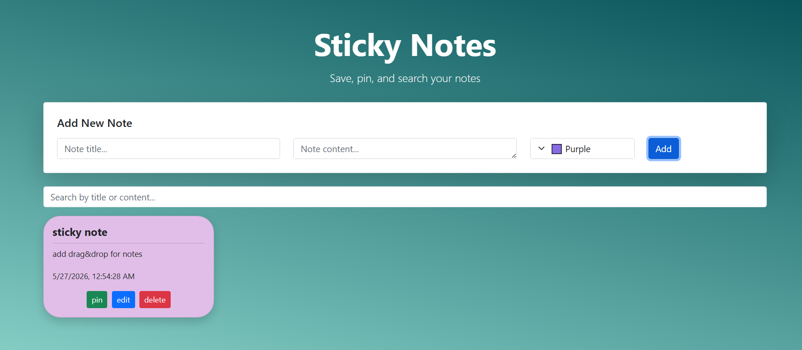

# Sticky Notes App

A modern sticky notes web application built with HTML, CSS, JavaScript, and Bootstrap.

## Preview



## Features

- Create notes with title, content, and custom colors
- Pin important notes
- Search notes instantly
- Edit and delete notes
- Auto-save notes using localStorage
- Responsive design
- Smooth animations and hover effects

## Technologies Used

- HTML5
- CSS3
- Bootstrap 
- JavaScript (ES6)
- localStorage API


## Getting Started

1. Clone the repository

```bash
git clone https://github.com/zibaimani/sticky-notes-app.git
```

2. Open `index.html` in your browser


## Live Demo

https://zibaimani.github.io/sticky-notes-app/

## License

MIT
